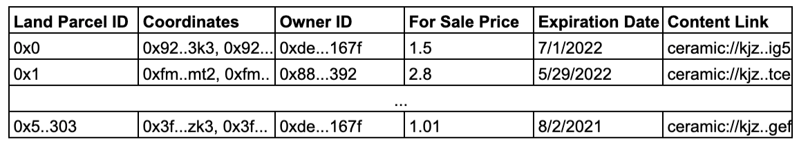

# Digital Land Registry

In essence, the Digital Land Registry \(DLR\) is a global list of land parcel entries with links to digital content.

This list is maintained and publicly available on the Ethereum network. Smart contract logic enforces the rules of [partial common ownership](partial-common-ownership.md) for entries \(i.e. land parcels\) on the list. Only the current land holder can modify the content links associated to a land parcel.

It's conceptually similar to the Domain Name Service \(DNS\) of the World Wide Web. On the WWW, a publisher purchases a domain name \(and pays the required renewal fees\) to obtain the right to point the domain name to an IP address of their choice. When a web user enters a URL, their browser references one of the numerous DNS servers around the world and navigates them to the appropriate server/resolves the publisher's content.

Blockchain-based domain names like [Ethereum Name Service](https://ens.domains/) have become popular because DNS's basic functionality can be replicated, improved \(censorship resistance, trust minimization, etc.\), and extended with smart contract infrastructure.

The DLR extends this idea to create "spatial domain names." When Geo Web users visit a physical location, their [browser](spatial-browser-intro.md) references the corresponding land parcel in one of the many distributed copies of the DLR and automatically resolves the publisher's content.

The Geo Web instantly benefits from Ethereum's security, global distribution, and decentralized trust through this smart contract implementation of the DLR. Building something similar from the ground up on traditional internet infrastructure would take years, government or mega-corporation backing, and/or trust in a new third-party. The Geo Web can be bootstrapped into existence simply by users/browsers choosing reference the DLR smart contracts.

