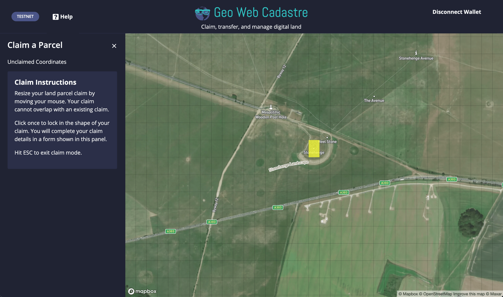

# Geo Web Coordinate

## Summary

The Geo Web Coordinate system is the basis for the spatial definition of all [Geo Web land parcels](../../concepts/digital-land.md).

The system consists of a fixed global grid optimized for EVM smart contracting efficiency. The system's grid lines create rectangular areas referred to as Geo Web Coordinates. Each Geo Web land parcel is an array of Geo Web Coordinates.



In the testnet implementation, a larger grid size was used for more practical large land claims. Mainnet will use a \(smaller\) grid size that balances transaction fees/size with enabling faithful representation of existing real world property lines. This is one of the reason that the Geo Web will be implemented on a ETH Layer 2 network \(evaluation is underway\).

## Implementation \(WIP\)

### Code

[`GeoWebCoordinate.sol`](https://github.com/Geo-Web-Project/core-contracts/blob/master/contracts/GeoWebCoordinate.sol)\`\`

### GeoWebCoordinate

GeoWebCoordinate is an unsigned 64-bit integer that contains x and y coordinates in the upper and lower 32 bits, respectively.

### Grid Size

```text
uint64 constant MAX_X = ((2**19) - 1);
uint64 constant MAX_Y = ((2**18) - 1);
```

Sets the fixed number of latitudinal and longitudinal gridlines.

### traverse

```text
    function traverse(
        uint64 origin,
        uint256 direction,
        uint256 _i_x,
        uint256 _i_y,
        uint256 _i
    )
        public
        pure
        returns (
            uint64 destination,
            uint256 i_x,
            uint256 i_y,
            uint256 i
        );
```

Returns the destination coordinate traversed in single direction from the origin coordinate.

### toWordIndex

```text
    function toWordIndex(uint64 coord)
        public
        pure
        returns (
            uint256 i_x,
            uint256 i_y,
            uint256 i
        );
```

Returns a word index converted from a coordinate.

### GeoWebCoordinatePath

GeoWebCoordinatePath stores a path of directions in a uint256. The most significant 8 bits encodes the length of the path.

```text
    uint256 constant INNER_PATH_MASK = (2**(256 - 8)) - 1;
    uint256 constant PATH_SEGMENT_MASK = (2**2) - 1;
```

### nextDirection

```text
    function nextDirection(uint256 path)
        public
        pure
        returns (
            bool hasNext,
            uint256 direction,
            uint256 nextPath
        );
```

Returns the next direction \(if it exists\) from a path.

