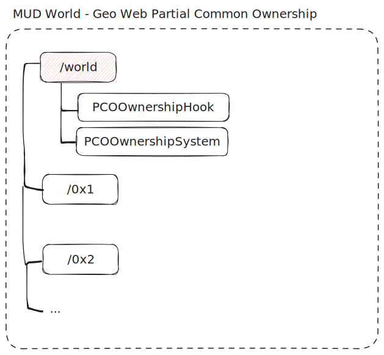

# MUD World

Geo Web land parcel content is published onchain to a single [MUD](https://mud.dev) World. MUD is an EVM framework that handles access control, indexing, and extensibility to enable building [Autonomous Worlds](https://0xparc.org/blog/autonomous-worlds).

Each [PCO](../../concepts/partial-common-ownership) parcel in the Geo Web is assigned a namespace in the global MUD world. The current owner of the parcel is the only one who can take ownership of the corresponding namespace for that parcel. They are then free to do what they wish so long as they keep paying the network fee. This includes keeping write permissions to themselves, opening up writing to anyone or any combination in between.

## Global Hooks and Systems

In order to enforce the mechanics of [PCO](../../concepts/partial-common-ownership), the world has a [custom hook](https://mud.dev/store/advanced-features#storage-hooks) and [system](https://mud.dev/world/world-101#systems) installed in the `/world` namespace.

A hook on `/world/NamespaceOwner` enforces that at any given time the namespace owner can only be changed to the current owner of the corresponding parcel. A custom system can then allow the namespace to be created upon claiming, or the ownership of the namespace transferred to the new parcel owner.

:::caution
By default, the namespace owner can delegate permissions to others for any resource in the namespace. When the ownership changes hands, it is the **responsibility of the new owner (or their user agent)** to revoke access to anyone who may have been granted access to resources during the previous ownership cycle.
:::

## Deployments

Current deployments can be found [here](https://github.com/Geo-Web-Project/mud-world-base/blob/main/packages/contracts/worlds.json).

## Open Questions

- Should there be a root owner of the world?
  - If not, how do upgrades occur?
  - Various client teams could attest to what world is the "correct" one via [EAS](https://attest.sh). Upgrading would simply be attesting a new, immutable world.
  - New world somehow falls back to the old?
