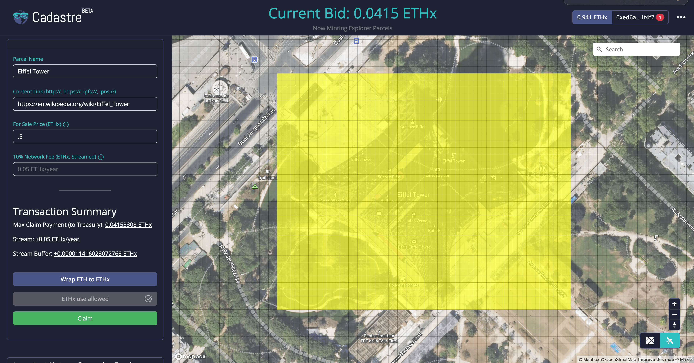
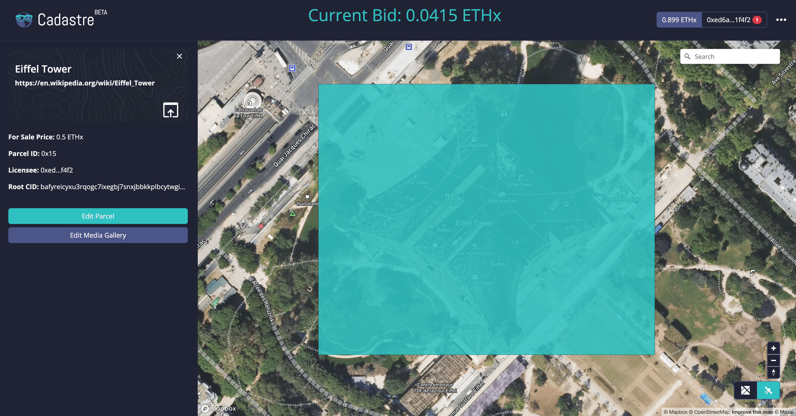

# Making a Fair Launch Claim

The Geo Web was initiated with a 30-day [fair launch auction](../concepts/fair-launch.md) on December 15, 2022, at 17:00 UTC.&#x20;

This auction format requires the user to make a one-time ETHx payment to the Geo Web treasury (based on the current auction price) in addition to the ongoing [partial common ownership licensing requirements](../concepts/partial-common-ownership.md).

Let's take a look at this transaction flow for making a fair launch claim:

1\. Navigate to the Geo Web Cadastre ([https://geoweb.land/](https://geoweb.land/) or [https://cadastre.eth.limo/](https://cadastre.eth.limo/)). **Connect your web3 wallet**.

<figure><figcaption>
The whole world is at your fingertips on the Cadastre. The current fair launch auction price is shown in the header.
</figcaption></figure>

2\. Search for, zoom, and/or pan to the location where you want to make a parcel claim. **Click once on the map to establish a corner of your desired parcel shape** (Please be patient as the grid renders. We'll make performance improvements over time :smile: ):

<figure><figcaption>
Starting a parcel claim at the Eiffel Tower. Pending parcel claims show as yellow rectangles in the Geo Web Coordinate grid.
</figcaption></figure>

3\. **Move your mouse and pan the map (click and hold) as needed to expand your parcel** to the desired size and shape. [Parcels are currently limited](../developers/core-contracts/registrydiamond/geowebparcelfacet/) to rectangles with 3,000 or fewer [Coordinates](../developers/core-contracts/registrydiamond/geowebparcelfacet/geo-web-coordinates.md). Parcels also cannot exceed 200 coordinates North-to-South or East-to-West. **Click a second time to lock in your shape**:

<figure><figcaption>
Geo Web parcels are user-defined, but with practical restrictions for market and technical reasons. 
</figcaption></figure>

4\. Once your parcel shape is locked in, you can **enter a name and URI link** for your prospective parcel in the _Transaction Panel_:

<figure><figcaption>
Giving your parcel a name and URI link are two extremely simple <a href="../developers/content-layer/">content-linking</a> use cases for Geo Web parcels.
</figcaption></figure>

5\. Next, **enter your `For Sale Price` (in ETHx) for the parcel**. This value should represent the value that you would be willing to sell this parcel for (it can be adjusted later). This price must be greater than or equal to the `Current Required Bid` shown in the _Dutch Auction Details_ section and in the header:

<figure><figcaption>
During the Dutch auction, your For Sale Price must be greater than or equal to the current required auction bid.
</figcaption></figure>

6\. The ongoing `Network Fee` you are required to pay is proportional to the `For Sale Price` that you enter. This is a key requirement of [partial common ownership](../concepts/partial-common-ownership.md). You'll pay these `Network Fees` by opening and maintaining a per-second ETHx stream to the Geo Web treasury. **The **_**Transaction Summary**_** shows the details of the three payment components required to make your claim: the fair launch claim payment, an ongoing payment stream, & a** [**stream buffer**](https://help.superfluid.finance/en/articles/5744874-how-do-stream-buffers-work-in-superfluid)**.**&#x20;

<figure><figcaption>
Network Fees are proportional to entered For Sale Price and are paid via an ETHx steam. They collected in addition to the one-time payment required by the fair launch auction.
</figcaption></figure>

7\. All payments and streams in the Geo Web land market are made in ETHx—[a super token-wrapped version of ETH](https://docs.superfluid.finance/superfluid/protocol-overview/in-depth-overview/super-tokens). If you don't have **enough ETHx to complete the claim transaction AND maintain a non-zero balance** for a reasonable period of time (streams deduct from your balance every second!), then **you can **_**Wrap ETH to ETHx**_** by clicking the corresponding purple button in the **_**Transaction Panel**_** and then submitting a transaction with the desired value in the modal**:

<figure><figcaption>
The Wrap ETH to ETHX modal allows you to prepare your ETH for use in the Geo Web's streaming payment land market. Make sure to maintain a non-zero ETHx balance so your streams &#x26; parcels aren't foreclosed!
</figcaption></figure>

8\. ETHx is an ERC-20 extension token. Token spend allowances and streams must be explicitly authorized to complete your claim. **Click the dynamic teal **_**Allow...**_** button to authorize the required one-time token transfers (fair launch claim payment, stream buffer) and/or stream (Network Fees).** The triggered transaction(s) in your web3 wallet must be accepted and confirmed on-chain before proceeding. For security purposes, we default to only authorizing the exact amounts needed to complete the claim:&#x20;

<figure><figcaption>
The teal "Allow" button will show the authorization transactions required for the claim and their progress as you complete them in your web3 wallet.
</figcaption></figure>

9\. After all required authorization transactions are confirmed, the Claim button will be enabled. **Click the green **_**Claim**_** button in the **_**Transaction Panel**_** then review and confirm the transaction in your web3 wallet.** Note that the auction claim payment is constantly decreasing. You'll only transfer the amount of ETHx corresponding to the auction value at the time your claim transaction is confirmed on-chain.

<figure><figcaption>
This parcel is ready to be claimed! 
</figcaption></figure>

10\. **Success! You are a Geo Web landholder.** Once your claim transaction is confirmed on-chain, the Cadastre will fetch these updates from the Geo Web subgraph and content layer and display the new state (again, patience is appreciated with the web3 stack). **You can now begin linking content to your parcel via the Media Gallery. You may also return to the parcel to edit your For Sale Price and Network Fee streams as needed:**

<figure><figcaption>
This user now controls the space on the Geo Web at the Eiffel Tower!
</figcaption></figure>

