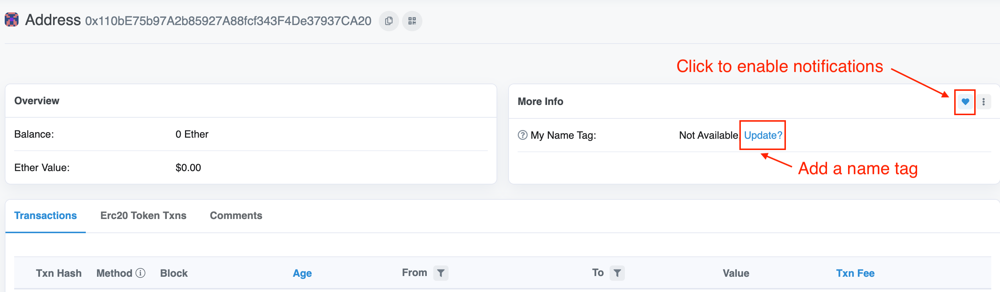
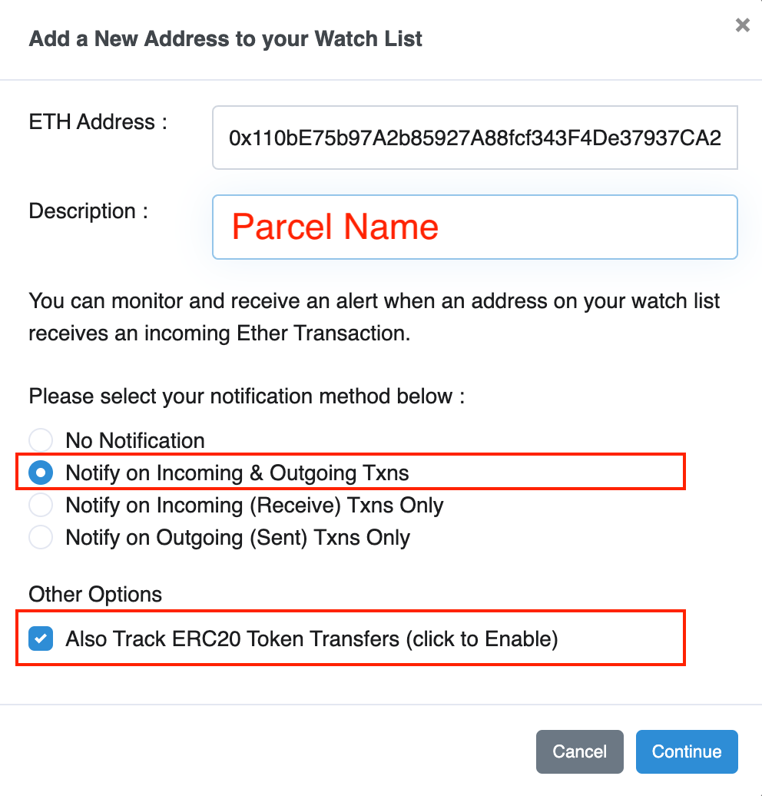

# Parcel Monitoring & Notifications

The Geo Web's [partial common ownership](../concepts/partial-common-ownership.md) land market gives licensors 7 days to respond to incoming bids. To help avoid missing the response window after a rival bid, we suggest setting up notification emails for all the parcels in your portfolio.&#x20;

This guide will walk through how to use [Optimistic Etherscan](https://optimistic.etherscan.io/)'s _Watch List_ functionality to monitor all of your Geo Web parcels:


An Optimistic Etherscan account is required to use this functionality. If you don't have one yet, you can sign up for one here: [https://optimistic.etherscan.io/register](https://optimistic.etherscan.io/register).&#x20;

Use an email that you regularly monitor!


1. Log in to your Optimistic Etherscan account: [https://optimistic.etherscan.io/login](https://optimistic.etherscan.io/login)
2. Search for and navigate to the wallet address that currently holds the parcel(s) you want to monitor.
3. Click on the `Erc721 Token Txns` tab within the wallet.
4. Geo Web parcels will be displayed as `Geo Web Parcel License (GEOL)` tokens in this list.
5. Click on the value shown under `Txn Hash` that corresponds to the Geo Web parcel/GEOL token you want to set notifications for.


If you don't know the `TokenID` of the parcel that you want to monitor, navigate to and click on the parcel on the [Cadastre](https://geoweb.land/).&#x20;

The `Parcel ID` displayed in the details window is the `TokenID` (in hexadecimal format). You can on the ID to open the corresponding GEOL token page on Optimistic Etherscan.


6. In the _ERC-20 Tokens Transferred_ section of the transaction page, click on the `To` address for the smaller of the two ETHx token transfers. This transfer corresponds to your stream buffer deposit.

<figure><figcaption>
Finding the stream buffer deposit on a Geo Web land claim
</figcaption></figure>

7. Click on the address shown in the _Filtered by Token Holder_ section found in the middle of the page.&#x20;

<figure><figcaption>
The "Filtered By" address corresponds to the parcel's BeaconProxy contract
</figcaption></figure>

8. This address/page corresponds to your parcel's to [BeaconDimaond](../developers/core-contracts/beacondiamond/) contract. It is the hub for any subsequent market transactions involving this parcel, so it is our target for monitoring.
9. Give your parcel's BeaconDiamond a custom name tag for easier tracking by clicking `Update?` in the _More Info_ section of the page. Use something short and descriptive for the best display results throughout Etherscan.

<figure><figcaption>
We made it! This contract address is the hub of transactions involving the parcel.
</figcaption></figure>

10. Click the heart icon at the top-right of the _More Info_ section.
11. On the following notification setup screen, enter the parcel name for the `Description`, select `Notify on Incoming & Outgoing Txns`, and check the `Also Track ERC20 Token Transfers` option.

<figure><figcaption>
Naming and configuring your parcel monitoring notifications
</figcaption></figure>

12. You will now receive notification emails when your parcel's `For Sale Price` is adjusted or a bid is placed on it.&#x20;
13. You can currently monitor up to 50 addresses for free, so repeat this process for your other parcels!


The Superfluid [Dashboard](https://app.superfluid.finance/) & [Console](https://console.superfluid.finance/) are other great tools to track and visualize your Geo Web parcels + streams.&#x20;

**Warning:** Don't manually cancel your streams on the Superfluid Dashboard or your parcels will go into foreclosure!&#x20;

