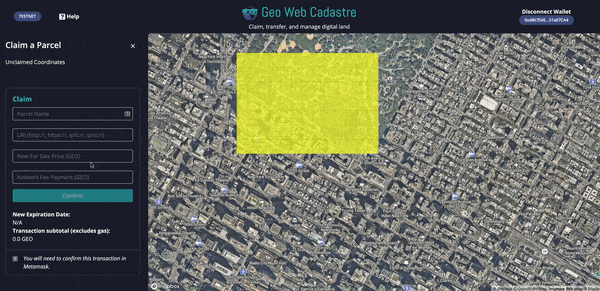

# Quick Start Requirements

The Geo Web network is under beta development. That doesn't mean that you can't start using the Geo Web today to anchor digital content to the physical world though.

The testnet version of the Geo Web is live on the Ethereum Kovan network. Testnet publishing and browsing function just like our mainnet will, but without the economic incentives \(freely available test tokens are used to transact in the land market\).

Below are the requirements to begin publishing, building, and experimenting on the Geo Web today:


If you encounter any issues, [join our Discord server](https://discord.com/invite/reXgPru7ck) and send a message to the Geo Web team. We can help troubleshoot your setup, send you test tokens, etc. There are no bad questions!


* Install and setup a wallet in the latest version of [**MetaMask**](https://metamask.io/download.html) _\*\*_browser extension
* Navigate to the [**Geo Web Cadastre**](https://geoweb.eth.link/)\*\*\*\*
* Switch to the **Kovan Test Network** in your MetaMask extension

* Click **Connect Wallet** button on the Cadastre and follow the prompts in MetaMask
  * The ETH wallet address that you connect via MetaMask will serve as your "Geo Web account" for transacting in the land market

* Follow the pop-up prompts to link an **IDX/3ID DID** to your ETH address
  * This DID will be used to manage the documents linked to your Geo Web land parcels

* Single-click on an **existing parcel or unclaimed coordinate** on the map to [begin your first transaction](../concepts/land-transaction-types.md)
  * For existing parcels, click the _Initiate Transfer_ button in the left panel
  * For new parcels, define your desired parcel shape and single-click again to lock it in

* Scroll to the bottom of the transaction panel and complete the **wallet-token requirements**:
  * Claim [Kovan ETH ](https://faucet.kovan.network/)\(externally maintained faucet\)
  * Claim Kovan GEO \(MetaMask transaction\)
  * Authorize the Cadastre to spend your tokens \(MetaMask transaction\)

* Complete and submit the required **land parcel fields in the transaction panel** 
* Sign the triggered **MetaMask transaction**
* After your transaction is confirmed on the network, the Cadastre will refresh to **display your new Geo Web land parcel**

\*Recommended, but not required - **Install an IPFS node** \([Desktop](https://docs.ipfs.io/install/ipfs-desktop/#ipfs-desktop) or [Command Line](https://docs.ipfs.io/how-to/command-line-quick-start/) version\) and the [IPFS Browser Companion](https://github.com/ipfs/ipfs-desktop#quick-install-shortcuts). Running an IPFS node on your machine means that Geo Web content publishing and resolution is completed peer-to-peer rather than through a centralized gateway.

